# Linked list
## node
- A **node** is a structure that contains two main parts:
    1. **Data**: The actual value or information that the node stores. This could be an integer, a string, or any other type of data.
    2. **Pointer (or next)**: A reference to the next node in the list.

---

## Train Analogy

- You can imagine a node in a linked list as a car in a train, and the next pointer is like the coupling that connects one train car to the next.
---

## What is a Linked List?
-  A **Linked List** is a linear data structure where elements, called nodes, are connected by pointers. Unlike arrays, linked lists do not store elements in contiguous memory locations.
---

## How a Singly Linked List Works:
- The first node is called the **head**, and it points to the next node in the list.
- Each node contains data and a pointer point to the next node.
- The last node’s pointer is set to ``null``.
- we using the head pointer to access any node in the linked list.
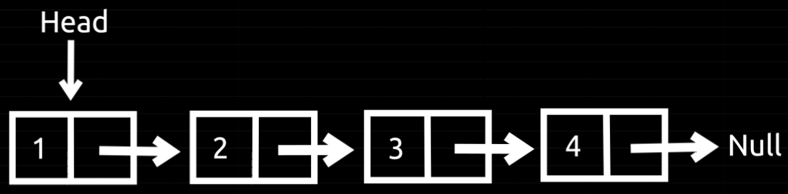
---

## Operations in a Linked List
### Insertion
- **We have two cases:**
    1. **If this node is the first node in the list:**
        - We create this node, assign a value, and set its next pointer to ``null``. The ``head pointer`` will point to this node.
          
          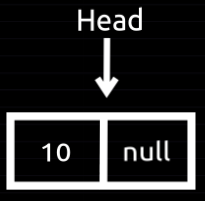
    2. **If we already have a list, we can insert:**
        - **At the beginning:**
            1. Create a new node and assign a value to it (*in my case, I chose ``value = 10``*).
            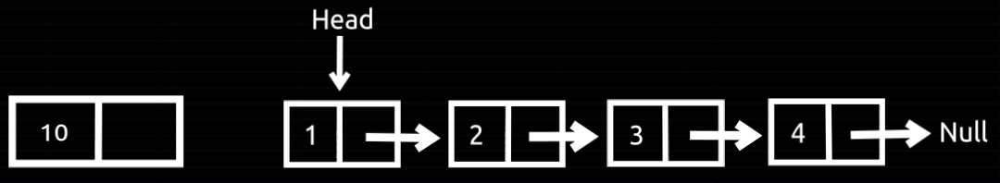
            2. Connect this node with list 
                - We can do this by using the next pointer to point to the node that the head pointer is currently pointing to. This connects the new node with the list.
                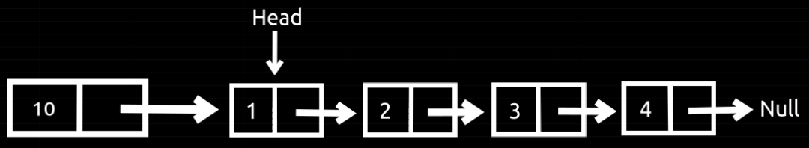
                - Then we must move head pointer to the new node.
                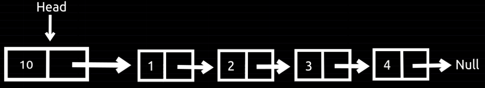
        - **At the end:**
            1. Create a new node and assign a value to it (*in my case, I chose ``value = 10``*).
            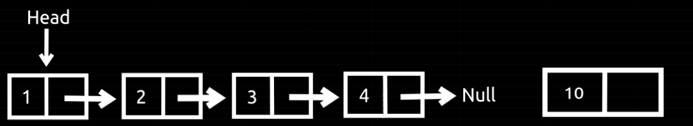
            2. We need to access the last node in the list by using a temporary pointer.
            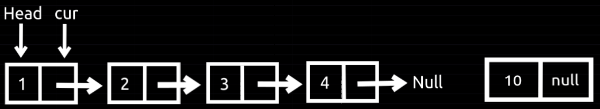
            3. Move this pointer to the last node.
            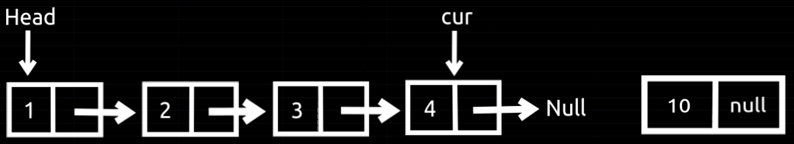
            4. Now, connect the list with the new node using the next pointer of the last node.
            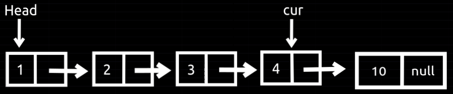
        ---
        - **In the middle**
            1. Create a new node and assign a value to it (*in my case, I chose ``value = 10``*).
            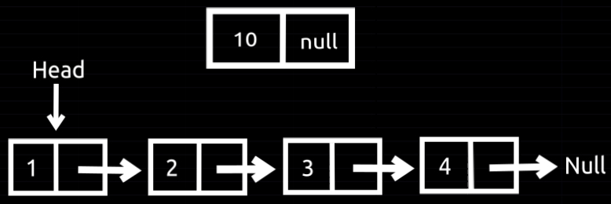
            2. Create a temporary pointer and point it to the node after which you need to insert the new node.
            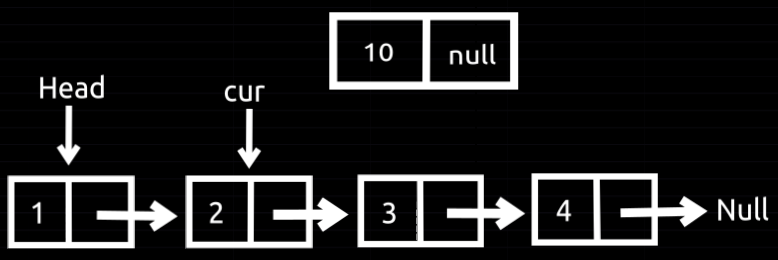
            3. Use the next pointer of the current node (that the temporary pointer points to) and point it to the new node.
            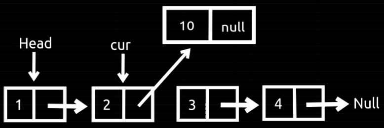
            4. Use the next pointer of the new node to point to the next node in the list.
            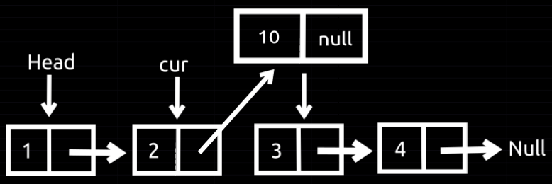

### Deletion
- **First, check that your list is not empty.**
- **Delete from the beginning:**
    1. Create a new pointer that points to the first node.
        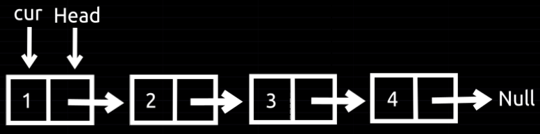

    2. Move the ``head`` to the next node.
        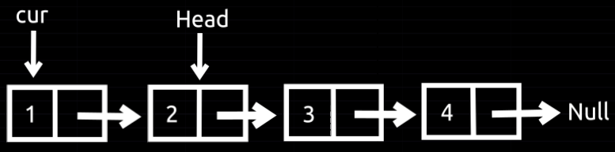

    3. Then delete the first node.
        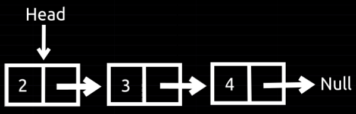
- **Delete from the end**
    1. Create a new pointer that points to the last node.
    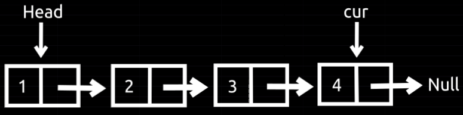
    2. Then delete the last node.
    

- **Delete from the middle**
    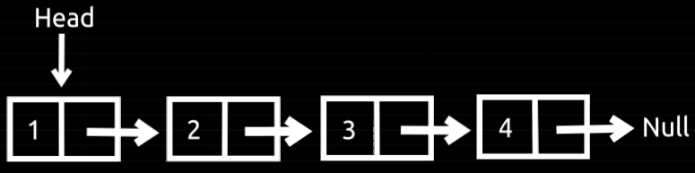
    - Note: We need to delete the node with the ``value 3``.
    1. Create a pointer that points to the node before the target node.
    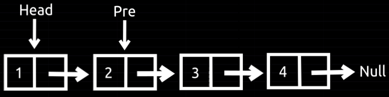
    2. Create another pointer that points to the target node.
    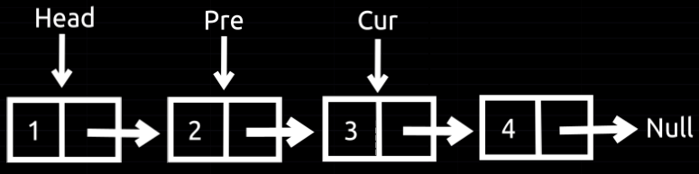
    3. Connect the node (the ``pre`` pointer points to) with the node after the ``cur`` pointer.
    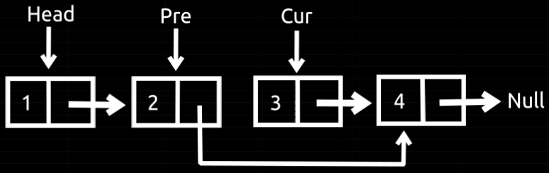
    4. Delete the node that the ``cur`` pointer points to.
    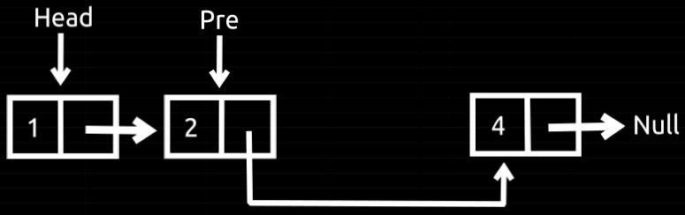

### Traversal
Traversing a linked list involves going through each node in the list, starting from the head, and visiting each node one by one.
1. Create a pointer that points to the first node.
    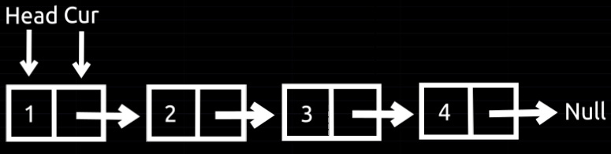 
2. Print the value of the node that the pointer points to.
3. Move the pointer to the next node and print its value.
    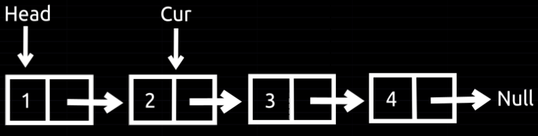
4. Repeat this process until you reach the end of the list.
---
## Types of Linked Lists
1. **Singly Linked List**
   - **Structure**: Each node has two parts: the data and a pointer (or reference) to the next node in the sequence.
   - **Traversal**: You can traverse the list in only one direction—from the head node to the last node.
   - **Use Cases**: Suitable when you need simple linear traversal with minimal memory usage.

    

    ---

2. **Doubly Linked List**
   - **Structure**: Each node contains three parts: data, a pointer to the next node, and a pointer to the previous node.
   - **Traversal**: You can traverse the list in both directions (forward and backward).
   - **Advantages**: Efficient backward traversal and easy node deletion.
   - **Use Cases**: Suitable for complex data navigation, like undo/redo functionality in applications.
    
    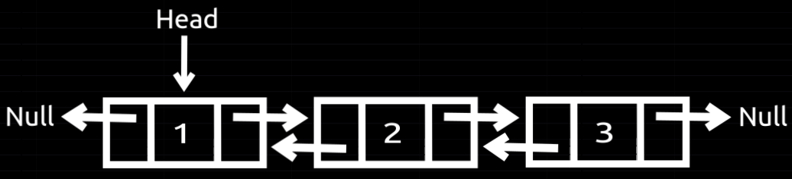

    ---

3. **Circular Linked List**
   - **Structure**: Similar to a singly linked list, but the last node points back to the head, forming a circular loop.
   - **Traversal**: You can traverse the list indefinitely in a circular fashion. The traversal continues until a specific stopping condition is met.
   - **Use Cases**: Useful in scenarios like round-robin scheduling or in applications that require repeated circular traversal.

    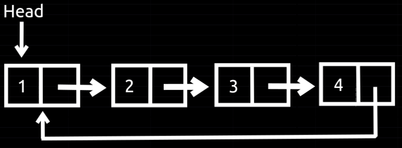
    ---

- **Searching About This:**
    - **Circular Doubly Linked List**
    - **Tail Pointer Linked List**
    - **Skip List**
---

## Advantages of Linked List:
1. **Dynamic Size:** Unlike arrays, linked lists can grow and shrink dynamically during runtime. This provides flexibility in memory management.
2. **Efficient Insertions/Deletions:**
Inserting or deleting elements at the beginning or middle of a linked list is generally faster than in an array, as you only need to change pointers rather than shifting elements.
3. **No Memory Wastage:** Memory is allocated as needed, so there’s no need to pre-allocate memory like in arrays, which might waste space if the array is underused.
4. **Efficient Memory Utilization:** Linked lists can easily accommodate variable sizes of data structures, and they don’t require contiguous memory blocks, which can avoid memory fragmentation.

## Disadvantages of Linked List:
1. **Higher Memory Overhead:** Each element (node) in a linked list requires additional memory for storing the pointer/reference to the next node, which can be inefficient in terms of memory usage.
2. **Slower Access Time:** Linked lists don’t provide direct access to elements, unlike arrays. To access an element, you must traverse the list from the head, which takes O(n) time in the worst case.
3. **More Complex Operations:** Linked lists generally involve more complex code for basic operations (like inserting or deleting a node) compared to arrays, where accessing and modifying elements is simpler.